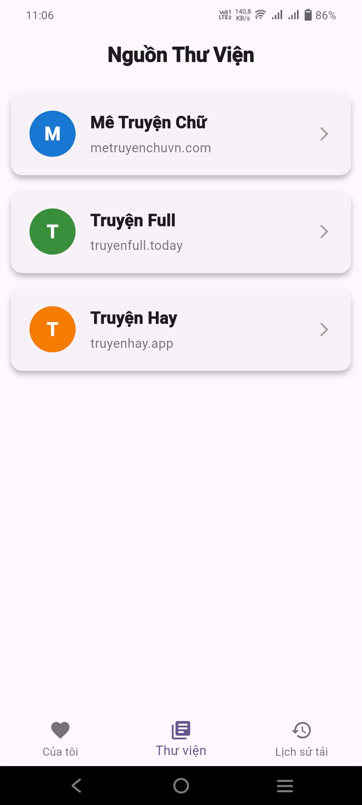
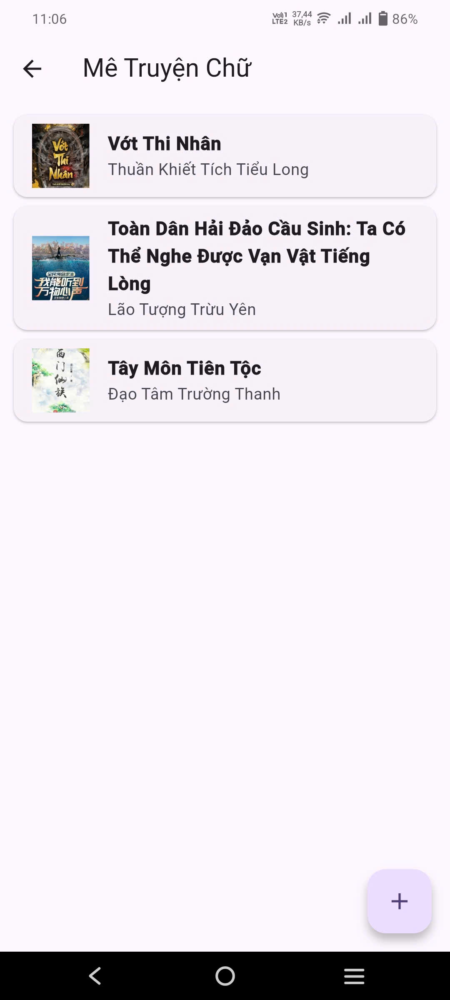
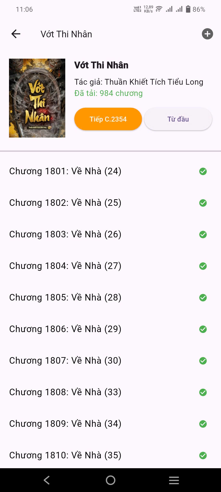
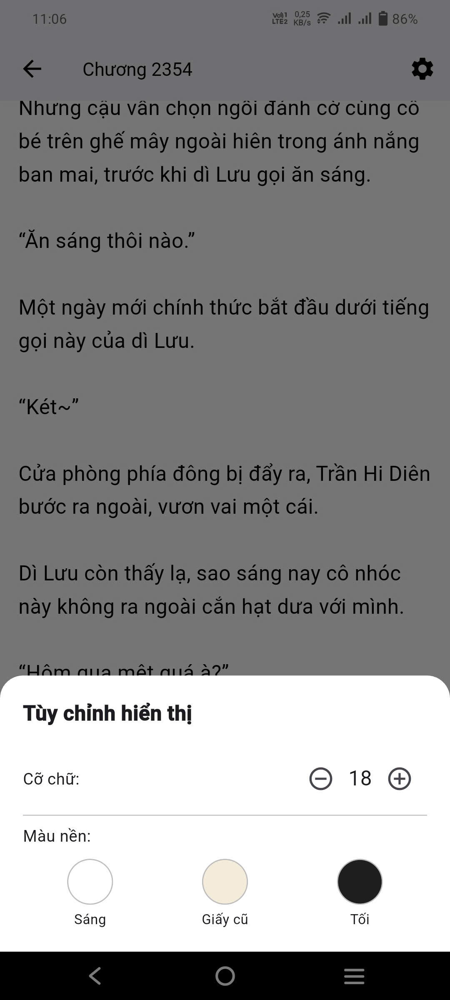

# 📚 Ứng dụng Đọc Truyện Offline


<p align="center">

**Đọc truyện miễn phí • Không quảng cáo • Hoạt động hoàn toàn offline**


</p>


------------------------------------------------------------------------

## ✨ Giới thiệu

Đây là ứng dụng đọc truyện được phát triển bằng **Flutter**, hướng đến
trải nghiệm đọc truyện đơn giản, nhanh và hoàn toàn miễn phí.

Thay vì lưu trữ truyện trên máy chủ, ứng dụng cho phép người dùng **dán
liên kết truyện từ các website được hỗ trợ**, sau đó tự động lấy danh
sách chương để bạn lựa chọn tải về và đọc ngoại tuyến.

## 📱 Hình ảnh ứng dụng


<p align="center">




</p>

<p align="center">




</p>

------------------------------------------------------------------------

# 🚀 Tính năng

## ❤️ Truyện của tôi

Không gian lưu trữ những bộ truyện yêu thích.

-   Đánh dấu truyện yêu thích.
-   Tiếp tục đọc nhanh.
-   Quản lý thư viện cá nhân.

> Chỉ những truyện đã tải mới có thể thêm vào **Truyện của tôi**.

------------------------------------------------------------------------

## 📚 Thư viện truyện

Nơi nhập và tải truyện.

Hiện ứng dụng hỗ trợ:

-   Cào truyện miễn phí từ **03 website**.
-   Chỉ cần dán link truyện.
-   Tự động lấy danh sách chương.
-   Chọn chương cần tải.
-   Đọc hoàn toàn offline.

------------------------------------------------------------------------

## ⬇️ Lịch sử tải

Quản lý các truyện đã tải xuống.

-   Xem danh sách truyện đã tải.
-   Quản lý dữ liệu lưu trên máy.
-   Thêm truyện vào **Truyện của tôi**.

------------------------------------------------------------------------

# ⭐ Điểm nổi bật

-   🎉 Miễn phí 100%.
-   🚫 Không quảng cáo.
-   📥 Đọc ngoại tuyến.
-   ⚡ Giao diện nhẹ và mượt.
-   📚 Tự động lấy danh sách chương.
-   ❤️ Quản lý thư viện truyện cá nhân.
-   📱 Phát triển bằng Flutter.

------------------------------------------------------------------------

# 🔄 Quy trình sử dụng

``` text
Dán link truyện
      │
      ▼
Lấy danh sách chương
      │
      ▼
Chọn chương cần tải
      │
      ▼
Tải về máy
      │
      ▼
Lưu trong Lịch sử tải
      │
      ▼
Thêm vào Truyện của tôi (Không bắt buộc)
      │
      ▼
Đọc Offline
```

------------------------------------------------------------------------

# 🛠️ Công nghệ sử dụng

-   Flutter
-   Dart
-   Isar 
-   HTTP Crawling
-   Local Storage

------------------------------------------------------------------------

# ❤️ Mục tiêu

Mang đến một ứng dụng đọc truyện:

-   Miễn phí.
-   Không quảng cáo.
-   Đọc offline mọi lúc.
-   Quản lý truyện dễ dàng.
-   Trải nghiệm gọn nhẹ và thân thiện.
